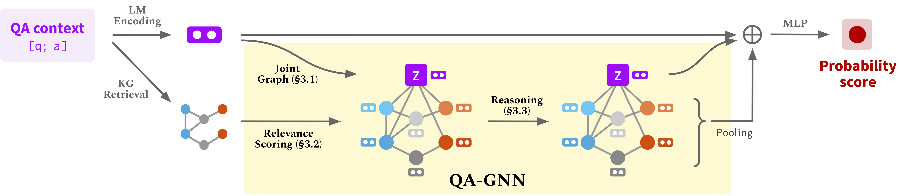

# 任务2
任务要求：The task aims to collect and organize question-answering data from the open-source community to construct an open, multi-domain question-answering dataset, and to implement a question-answering model based on this dataset. By analyzing the behavior and language characteristics of members in the open-source community during the process of asking and answering questions, as well as the diversity and complexity of questions, you will design and train an efficient question-answering model capable of accurately understanding and answering various questions, thereby promoting knowledge sharing and communication within the open-source community.

The relevant code and dataset for this task need to be provided in the repository.

# 数据集介绍
数据集来自8000 多条保险行业问答数据，15.6 万条电信问答数据，77 万条金融行业问答数据，3.6 万条法律问答数据，20.3 万条联通问答数据，4 万条农业银行问答数据，58.8 万条保险行业问答数据合并成的数据。
数据集各个字段的含义如下
- title:问题的标题
- question:问题内容（可为空）
- reply:回复内容
- isbest:是否是页面上显示的最佳答案

# 数据处理代码
数据处理部分的代码主要由data_merge.py 和 csv_to_json.py 两个文件构成
data_merge.py的作用是将多个csv文件合并成一个
csv_to_json.py文件的作用是将csv文件转换为json格式的输出以便于用于模型的训练的输入


# 模型代码介绍
### 0.环境配置
运行以下代码配置所需的conda enviroment
```bash
conda create -n qagnn python=3.7
source activate qagnn
pip install torch==1.8.0+cu101 -f https://download.pytorch.org/whl/torch_stable.html
pip install transformers==3.4.0
pip install nltk spacy==2.1.6
python -m spacy download en

# for torch-geometric
pip install torch-scatter==2.0.7 -f https://pytorch-geometric.com/whl/torch-1.8.0+cu101.html
pip install torch-sparse==0.6.9 -f https://pytorch-geometric.com/whl/torch-1.8.0+cu101.html
pip install torch-geometric==1.7.0 -f https://pytorch-geometric.com/whl/torch-1.8.0+cu101.html
```

### 1.下载数据

运行数据处理代码获得输入
运行preprogress.py代码来为输入数据提取子图


### 2.训练模型
For CommonsenseQA, run
```
./run_qagnn__csqa.sh
```
For OpenBookQA, run
```
./run_qagnn__obqa.sh
```
For MedQA-USMLE, run
```
./run_qagnn__medqa_usmle.sh
```
模型需要两种类型的输入
* `--{train,dev,test}_statements`: 处理jason格式的输入. 主要由 `load_input_tensors` 里的函数 `utils/data_utils.py`.
* `--{train,dev,test}_adj`: 处理为每个问题提取的KG子图 主要由 `load_sparse_adj_data_with_contextnode` 里的函数 `utils/data_utils.py`.

### 3. 评估训练模型
For CommonsenseQA, run
```
./eval_qagnn__csqa.sh
```
Similarly, for other datasets (OpenBookQA, MedQA-USMLE), run `./eval_qagnn__obqa.sh` and `./eval_qagnn__medqa_usmle.sh`.


### 4.使用新的数据集
- Convert your dataset to {train,dev,test}.statement.jsonl in .jsonl format 
- Create a directory in data/{yourdataset}/ to store the .jsonl files
- Modify preprocess.py and perform subgraph extraction for your data
- Modify utils/parser_utils.py to support your own dataset

# 模型介绍
<p align="center">
  
</p>
模型的主要特点主要有两点
- 相关性评分，我们使用语言模型（LMs）来估计知识图谱（KG）节点相对于给定的问答（QA）上下文的重要性
- 联合推理，我们将QA上下文和知识图谱连接起来形成联合图，并通过网络神经网络相互更新它们的表示