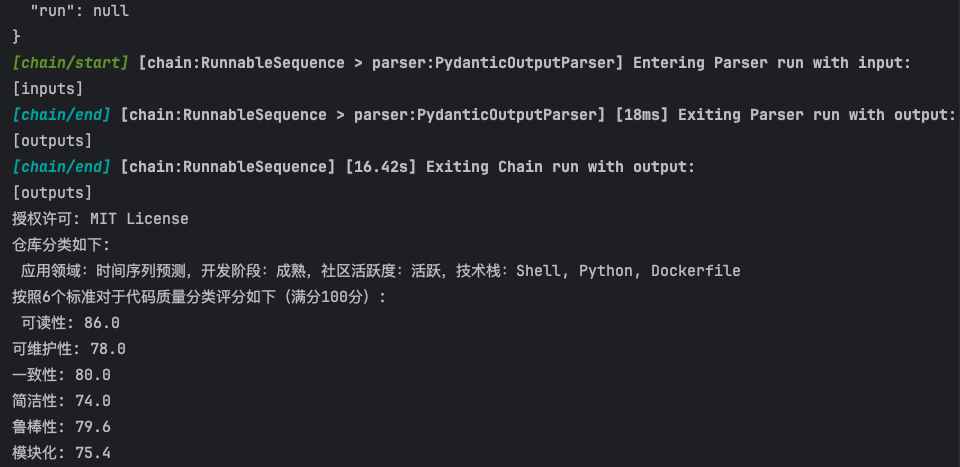

# README

## 概述

任务5旨在为Github仓库的分类问题构建一个多标签分类模型，能够根据Github上的元数据以及代码质量对于仓库进行打标、分类，从而更好地完成开源社区的各种任务。对于这个问题，我们组认为Github上的元数据（标签）以及代码都可以被总结为文本数据，而大语言模型天然在各类语言任务上具备zero-shot的能力，所以如何利用大语言模型构建完整工作流，实现自动化地对于仓库进行分类，是我们选择的切入点。在技术栈方面，我们选择使用langchain+ZhipuAI的方式构建了自动化的仓库分类模型，项目具备自动爬取Github指定链接仓库的元数据以及代码的能力，且无需进行任何训练或微调，即可通过langchain构建的工作流详细地分析并依据预设的几个标准分类当前仓库。


本项目包括以下几个主要组件：

- `get_info.py`：包含从GitHub API获取仓库信息的函数。
- `main.py`：主程序入口，用于调用其他模块并执行项目的主要逻辑。
- `code_loader.py`：用于从GitHub仓库克隆代码到本地的函数。
- `config.py`：包含项目配置，如GitHub访问令牌等。
- `requirements.txt`：列出了项目所需的Python依赖。
- `llm_classification.py`：包含使用语言模型对代码进行分类和质量分析的逻辑。

## 安装

要在本地运行此项目，请确保您的系统上安装了Python >= 3.8。然后，通过以下步骤安装所需的依赖：

```shell
pip install -r requirements.txt
```

## 使用方法

1. 配置`config.py`文件，填入您的GitHub访问令牌和LLM的API（本项目采用ZhipuAI）。
2. 运行`main.py`文件以开始项目。


## 分类依据

本项目使用`llm_classification.py`模块中的`analyze_repo_with_agent`函数对于仓库元数据进行分析，以如下标准对于仓库进行分类：
-  应用领域
-  开发阶段
-  社区活跃度
-  技术栈

本项目使用`llm_classification.py`模块中的`analyze_code_quality`函数来分析代码质量。它将随机选择一定数量的代码文件，并使用预定义的标准对它们进行评分，最终我们根据langchain的工作流汇总这些评分，得到项目的综合评分。评分标准包括：

- 可读性
- 可维护性
- 一致性
- 简洁性
- 健壮性
- 模块化


### Case Study



### 小组成员

| Task 5 组长 | 李垫   | 调研，技术选型，项目基本框架设计       |
| :---------: | ------ | -------------------------------------- |
|    组员     | 张豈明 | Langchain开发，项目基本逻辑设计        |
|    组员     | 叶韩辉 | 设计自动扒取Github代码以及元数据的函数 |
|    组员     | 吴行健 | Langchain开发，主要业务代码设计        |

