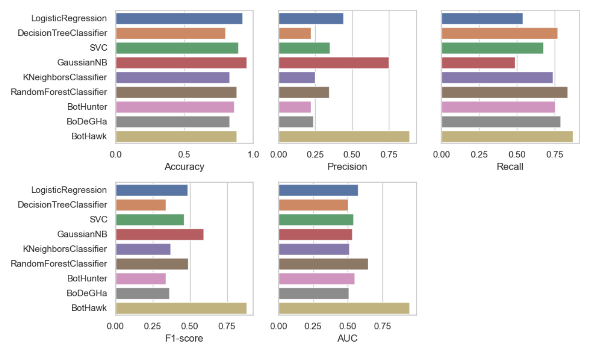

# Open Source Automation Robots Identification and Classification

### Research Background
Collaboration, as a social phenomenon, is increasingly significant in the software development lifecycle. Popular social coding platforms, such as GitHub, Bit-Bucket, and GitLab, provide environments for developers to share workspaces. However, large-scale collaboration also brings significant workload pressures on repository maintainers who need to communicate with contributors, review source code, handle contributor licensing issues, articulate project guidelines, execute tests and build code, merge pull requests, and more. To alleviate the burden of these repetitive tasks, open source software projects have recently started utilizing various software robots to streamline their operations. The application of robots also introduces a series of problems, including impersonation, spam, bias, and security risks. Therefore, many open source researchers need to identify open source software robot accounts and behaviors.

### Task Description
How can a model be designed and implemented to identify and classify robot behavior in open source software projects? This model needs to accurately identify robot behavior in open source projects and effectively classify them based on their behavioral patterns and objectives. Besides high predictive performance, the model also needs to possess strong interpretability and rationality.

### Task Challenges
Diversity of behavior patterns: Different robots have different functions and objectives, leading to diverse behavior patterns. Robots can perform tasks such as auto-replying to user queries, code review, and code merging. This diversity makes the identification and classification of robot behavior challenging.
Complexity of behavior patterns: For example, a code review robot might need to analyze the code's complexity, style, and correctness among other aspects. This complexity means that identifying and classifying robot behavior requires a high level of expertise and precise models.
Handling mixed behavior: Some robots may participate in project development along with human developers, which can lead to mixed behaviors. The model needs to be able to distinguish and handle these.

### Dataset
This task selected the most active repositories from the GHTorrent dataset between March 2021 and March 2022 to ensure generalizability and accuracy. Accounts with more than 100 activity logs were identified as "active accounts," and a portion of accounts was randomly selected from global accounts to create the "random accounts" dataset. To expand the dataset and ensure credibility in comparative experiments with the BIMAN and BoDeGha algorithms, data from BIMAN and BoDegHa were processed to obtain their GitHub IDs, selecting accounts active in the past year (activity data exceeding 10 logs). The data from "active accounts," "random accounts," "BIMAN accounts," and "BoDeGha accounts" were merged into one dataset, called the "mixed accounts." The data from "mixed accounts" were then cleaned, selecting 17 relevant features to ensure comprehensiveness. Finally, through a scientific labeling process and a visual annotation system, the accuracy of label annotation was maximized to create the OSS Robot Classification Dataset.

### Evaluation Metrics
To evaluate the performance of the robot identification model, this section employs a range of standard machine learning evaluation metrics, including Accuracy, Precision, Recall, F1-score, and the AUC value (Area Under the ROC Curve). Accuracy, precision, and recall primarily assess the model's classification capabilities, i.e., its ability to correctly identify positive and negative classes; the F1-score is a composite index balancing precision and recall; the AUC value reflects the model's performance across different classification thresholds.

### Model Experiments

In the OSS Robot Identification task, OpenPerf used various machine learning models for experimentation, including Logistic Regression, Decision Tree Classifier, SVM, Gaussian Naive Bayes, K-Nearest Neighbors, Random Forest Classifier, and models specifically designed for the OSS robot identification task, such as BotHunter, BoDeGha, and BotHawk. The table below and the accompanying figure illustrate the comparative performance of different algorithms across various evaluation metrics.

#### References
1. Bi F, Zhu Z, Wang W, Xia X, Khan H A, Pu P. BotHawk: An Approach for Bots Detection in Open Source Software Projects[J]. 2023. arXiv preprint arXiv:2307.13386.
