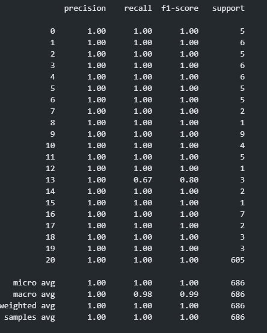
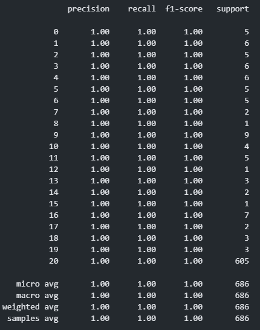
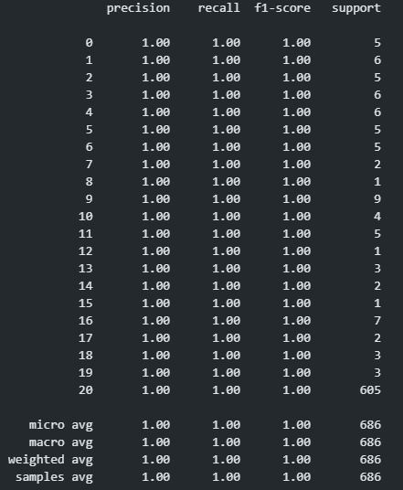
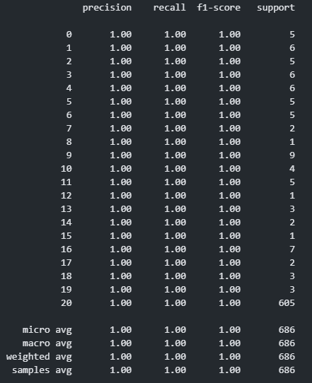
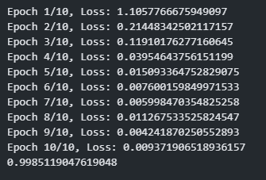

## 仓库信息爬取
首先使用github api，根据github仓库star数由高到低爬取前3000个仓库名称，然后根据根据仓库名称，使用pygithub库爬取具体仓库的代码目录结构，仓库描述，提交历史，readme文件，tags，标签信息，生成数据集，具体脚本如notebook所示。
## 模型训练及效果
分别使用逻辑回归、SVM、随机森林、MLP 和 LSTM 模型进行训练，并在划分好的测试集上验证结果。

1. MLP

   定义了一个三层的 MLP 网络进行多分类训练，生成分类报告，计算分类结果的精确率、召回率、F1 分数。

   

   

2. 逻辑回归

   使用 MultiOutputClassifier 包装器，对每个标签分别训练所属类别，已实现多分类器的效果。

   

   

3. SVM

   

   

4. 随机森林

   

   

5. LSTM

   定义一个 lstm 模型，设定好相应的超参数，dropout 设定为20%，loss 函数使用交叉熵损失，优化算法使用 Adam，学习率设置成0.001，计算测试集上的准确率。

   