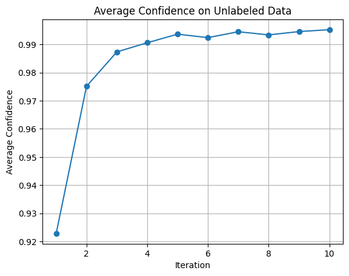

# 任务 8

任务要求：the aim of the task is to classify the role of developer in Github open source community. Based on the developer's behavior and influence in the project, the developer's role can be roughly divided into four categories: observer, contributor, maintainer, and leader. You need to construct a dataset and build a classification model to divide the role of the developer. You need to specify the method and the reason of dataset construction and the classification algorithm must be compare with other algorithm models. you'd better deeply analysis the behavior patterns based on classification result so that we can understand collaboration mechanism and open source ecology. The relevant code and dataset for this task need to be provided in the repository.

# 数据集介绍

总共 4783 条数据，下面是各个字段的含义

- Username:用户名。GitHub 用户的唯一标识符。
- Name:名字。用户在 GitHub 上的全名(如果有设置)2.
- Company: 公司。用户在 GitHub 上填写的公司信息(如果有设置)。
- Location: 位置。用户在 GitHub 上填写的地理位置(如果有设置)。4.
- Public Repos: 公共仓库数量。用户在 GitHub 上创建的公共代码仓库的数量。
- Followers: 粉丝数量。关注该用户的其他 GitHub 用户的数量。
- Following: 关注数量。该用户关注的其他 GitHub 用户的数量。
- Created At: 创建时间。该用户在 GitHub 上创建账号的时间。
- Updated At: 更新时间。用户资料最后一次更新的时间。9
- Commits:提交数量。用户在该组织的仓库中进行的代码提交总数。
- Pull Requests: 拉取请求数量。用户在该组织的仓库中创建的拉取请求总数.
- lssues: 问题数量。用户在该组织的仓库中创建的 GitHub lssues 总数。
- Comments:评论数量。用户在该组织的仓库中参与的评论总数。
- Repositories Contributed To: 贡献的仓库数量。包括以下情况：
  - 拥有者（Owner）：用户是该仓库的拥有者或在组织中的拥有者
  - 贡献者（Contributor）：用户对该仓库提交了代码（包括但不限于 Pull Requests 合并到主分支）
  - 成员（Member）：用户是某个团队的成员，而该团队具有对该仓库的访问权限。
  - Fork 作者（Fork Author）：用户 fork 了该仓库
- organization: 组织，本次使用的数据只有 microsoft 和 google
- url: 个人 github 网址。
- category：表示标签，各类标注了20个，以下是说明。
  - 标注1：表示 observer，主要标注依据是粉丝量较少，拉取请求和 commit 很少，
  - 标注2：表示 contributor，主要标注依据是有一定的拉取请求次数和 commit 次数，
  - 标注3：表示 maintainer，主要标注依据是拉取请求次数和 commit 次数较多
  - 标注4：表示 leader，拉取请求次数和 commit 次数较多，且粉丝数量较多，github 主页有 star 数较多的项目。

# 代码介绍

代码文件分为 scrawl.py 和 main.ipynb 这 2 部分，分别用于爬取数据和构建模型。

## 数据抓取代码

scrawl.py 是一个用于抓取 GitHub 组织成员及其活动数据的脚本。脚本利用 GitHub API 获取指定组织的成员信息，并进一步获取每个成员的详细数据，包括提交次数、拉取请求次数、问题数、评论数以及贡献的仓库数。以下是代码主要功能的概述：

1. **获取组织成员**：
    - `get_members` 函数通过分页请求获取组织成员列表。函数处理 API 速率限制问题，如果超出速率限制会等待 60 秒后重试。

2. **获取用户详细数据**：
    - `get_user_data_aux` 函数获取用户的详细数据，包括个人信息和各种贡献统计数据。
    - `get_user_data` 函数包含一个重试机制，最多重试 5 次，以处理请求异常。

3. **主程序**：
    - 使用 `argparse` 解析命令行参数，获取组织名和 GitHub API 令牌。
    - 加载或获取组织成员数据，并保存到本地 JSON 文件。
    - 加载或创建 CSV 文件，用于存储用户详细数据。
    - 遍历成员列表，检查每个成员是否已被抓取，如果未抓取，则获取并保存用户详细数据，并在每次请求之间随机延迟以减少速率限制的发生。

4. **保存数据**：
    - 成员数据以 JSON 文件形式保存，以便后续运行时无需重新获取。
    - 用户详细数据以 CSV 文件形式保存，便于分析和使用。

该脚本通过单线程方式运行，适合对 GitHub 组织成员及其活动数据进行系统性抓取和分析。

## 模型代码

这段代码是一个用于分类GitHub用户数据的机器学习项目，利用PyTorch构建和训练神经网络模型，并采用自训练（Self-Training）的半监督学习策略。以下是代码的简要介绍：

### 数据处理

1. **数据预处理**
   - 读取CSV文件并选择有用的属性，去除'category'为空的行。
   - 将时间戳转换为数值，并用`get_dummies`将分类数据转换为数值。
   - 填充NaN值，并划分有标签和无标签的数据。
   - 使用`StandardScaler`对数据进行标准化，并划分训练集和验证集。
   - 将数据转换为PyTorch张量。

2. **数据集和数据加载器**
   - 定义自定义数据集类`CustomDataset`，并创建训练、验证和无标签数据的DataLoader。

### 模型与训练

我们使用了全连接神经网络作为 backbone 模型。由于标签数据稀少，我们使用半监督学习对模型进行训练，其训练步骤课表述如下：

1. **生成伪标签**：伪标签是为未标记数据生成的标签，模型对这些标签的预测置信度较高。在生成伪标签的过程中，模型会对未标记数据进行预测，并对每个数据点计算每个类别的概率。如果预测的最高概率超过预定的阈值（例如0.9），则将该预测标签作为伪标签，并保存对应的数据点和置信度。这样可以确保只有模型高度确信的标签才被用于进一步训练。

2. **自训练**：这是一种半监督学习方法，其中模型首先在标记数据上进行训练，然后使用生成的伪标签对未标记数据进行训练。具体步骤如下：
   - **生成高置信度伪标签**：模型对未标记数据进行预测，选择置信度超过阈值的预测结果作为伪标签。
   - **创建伪标签数据加载器**：将带有伪标签的未标记数据转换为新的数据集和数据加载器，以便于进一步训练。
   - **训练模型**：在带有伪标签的数据上继续训练模型，通常与在标记数据上训练的过程类似，但只使用高置信度的伪标签。
   - **评估置信度**：在每次迭代中，计算未标记数据集上的平均置信度，作为模型训练进展的指标。如果平均置信度持续提高，表明模型在自训练过程中不断改进。

3. 循环反复执行上述步骤，在每次迭代中生成新的伪标签，并继续在这些数据上训练模型。这样，通过不断扩展训练数据集，模型可以从未标记数据中学习，进一步提高性能。最后，可以通过绘制平均置信度图表来直观展示模型在自训练过程中的改进情况。

### 评估

我们对有标签数据进行划分，其中 80% 为训练数据集，20% 为验证数据集。通过验证数据集，可以评估模型在验证集上的准确性。最终我们在验证数据集上的准确率达 56.25%。

此外，我们还绘制了平均置信度的变化曲线，如下。可以看到平均置信度呈上升趋势，且最后达到了较高的水平。

